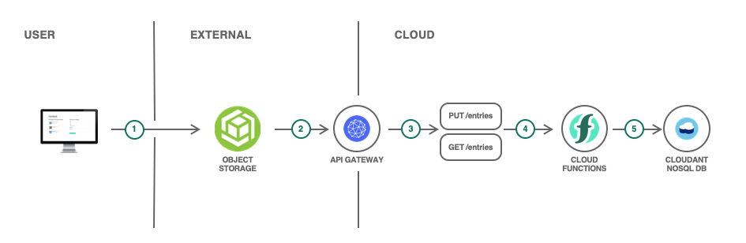

# Serverless Guestbook

This is my capstone project for [Application Development using Microservices and Serverless](https://www.coursera.org/learn/applications-development-microservices-serverless-openshift) module.

## Architecture

## Steps
- Deployed a serverless backend and a database (Cloudant, NOSQL)
- Exposed REST APIs
- Hosted a static website using object storage
- Deployed a static website as a microservice on Red Hat OpenShift
